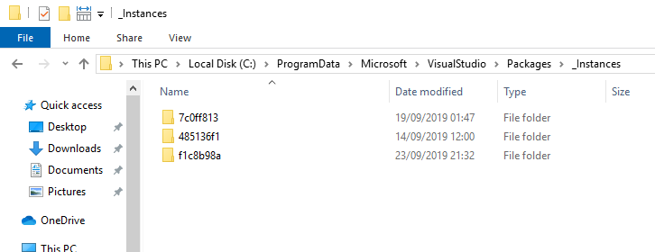
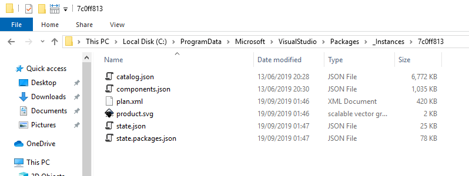

:toc:
:sectnums:
:toclevels: 5
:sectnumlevels: 5
:showcomments:
:xrefstyle: short
:icons: font
:source-highlighter: coderay
:tick: &#x2714;
:pound: &#xA3;

= Visual Studio 2017/2019 installation checker

This tool reports installations of Visual Studio. From Visual Studio 2017, it is possible to install multiple instances of Visual Studio on the same computer. You might
want to do this so that you have a different instance for each workload you develop for (e.g. an instance for desktop development and an instance for mobile development).

== Visual Studio Instance Information

You can see all installed instances of Visual Studio by looking in the folder

----
C:\ProgramData\Microsoft\VisualStudio\Packages\_Instances
----

In this folder you will see a subfolder for each instance:

In each subfolder you will find a `state.json` file with details of the installation for that instance:

You can open this file to get information about the installed instance such as:

* *Installation Path* - the path in `c:\program files (x86)` where this instance of Visual Studio is installed.
* *Installation Date* - the date on which this instance of Visual Studio was installed.
* *Update Date* - the date on which this instance of Visual Studio was last updated.
* *Layout Path* - the path to the offline installer (known as a layout) used to install this instance of Visual Studio if one was used. 
* *Installation Version* - the version of this instance of Visual Studio.

This code prints all of the above information

== Private Registry

From Visual Studio 2017, a private registry file is used: `privateregistry.bin` - no entries are stored in the Windows public registry. The registry file can be
found at

----
c:\users\<your-user-name>\appdata\local\microsoft\visualstudio\<version-id>_<instance-id>
----

where `version-id` is 15.x for Visual Studio 2017 and 16.x for Visual Studio 2019 and `instance-id` is an integer expressed as an 8-digit hexadecimal and is assigned
at install time. Installing the same Visual Studio version on different computers generally results in a different `instance-id`. Subsequent installations on the *same* PC
will have a different `instance-id`.

Determining the `instance-id`\s on the local system is the first step to discovering information about Visual Studio installations. They are determined by examining 
the folder `C:\ProgramData\Microsoft\VisualStudio\Packages\_Instances` as mentioned above. It appears that you can change the `instance-id` of an installation simply
by renaming the instance folder. You would then have to rename the appdata folder containing the `privateregistry.bin` to match the
new instance-id.

=== Opening the privateregistry.bin file.

In order to examine the `privateregistry.bin` file we need to use the
https://docs.microsoft.com/en-us/windows/win32/api/winreg/nf-winreg-regloadappkeya[`RegLoadAppKey`] Win32 API. If we wish to use this form C#, then we 
need to use `DllImport`.

----
[DllImport("advapi32.dll", SetLastError = true)]
private static extern int RegLoadAppKey(String hiveFile, out int hKey, RegSAM samDesired, int options, int reserved);
----

== Inside the Private Registry

The classic reason for inspecting the `privateregistry.bin` file is to look for installed extensions in an instance of Visual Studio.
These can be found under the registry key `Software\Microsoft\VisualStudio\{instance}\ExtensionManager\EnabledExtensions`. Under this key
there is one value per extension. The value of the registry key is the package GUID of the extension (typically marked as follows in 
the C# code for the extension:

----
    [Guid("3c6063ca-5f33-4889-aaae-387e9d5a0368")]
    public sealed class AMSExtensionsPackage : Package
----

where `Package` is a class from `Microsoft.VisualStudio.Shell`.)

== Microsoft.VisualStudio.Setup.Configuration

Microsoft provide a documented interface to enumerate Visual Studio instances.

TODO : provide more info.

== Visual Studio 2019 Information

=== Can I use C# 8 in Visual Studio 2019?

If you have updated Visual Studio 2019 to at least version 16.3, then the answer is "may be" :)

C# 8 requires changes in the runtime and will not be available on the .Net Framework until the .Net Framework merges with
.Net Core into a single framework with https://devblogs.microsoft.com/dotnet/introducing-net-5/[.Net 5.0] in November 2020.

C# 8 is currently available on .Net core 3.0 only.

=== Can I choose the supported language version in Visual Studio 2019?

No. This is no longer possible as it makes no sense. The supported language version is the highest version possible given
the framework version. For all currently supported versions of the .Net Framework, this is C# 7.3.

=== Can I use C++ 20 with Visual Studio 2019?

As of the date of writing this document, only a few of the features of C\++ 20 are available. In version 16.3,
C++ 20 https://devblogs.microsoft.com/cppblog/c20-concepts-are-here-in-visual-studio-2019-version-16-3/[_concepts_]
are fully implemented.